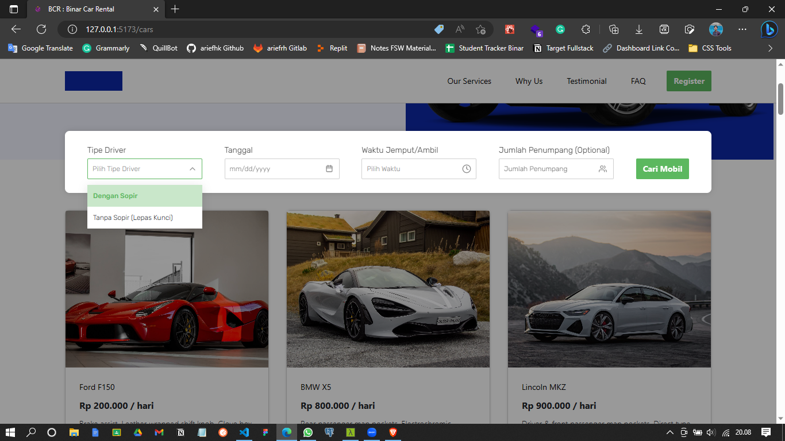

# Challenge Chapter 6

This project is about implemetation BE integration with SPA using React JS, state management with Redux (RTK), and code linter with ES-lint

## Deployment

-   https://fsw-challenge-6-arief.netlify.app/

## Screen Shot

1. Home
   

1. Search
   
   

## Accessing Routes

-   http://{{host}}/
-   http://{{host}}/cars

## How To Run

1. Install Dependencies

```bash
npm i
```

2. Run on Dev Mode

```bash
npm run dev
```
